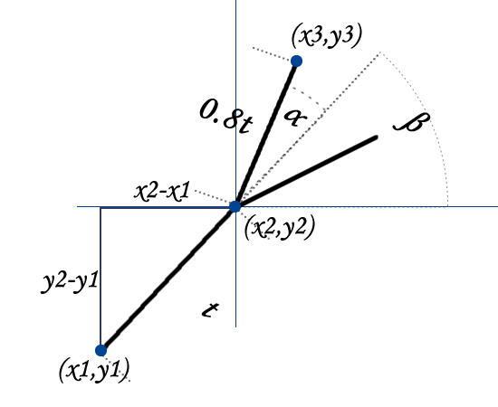
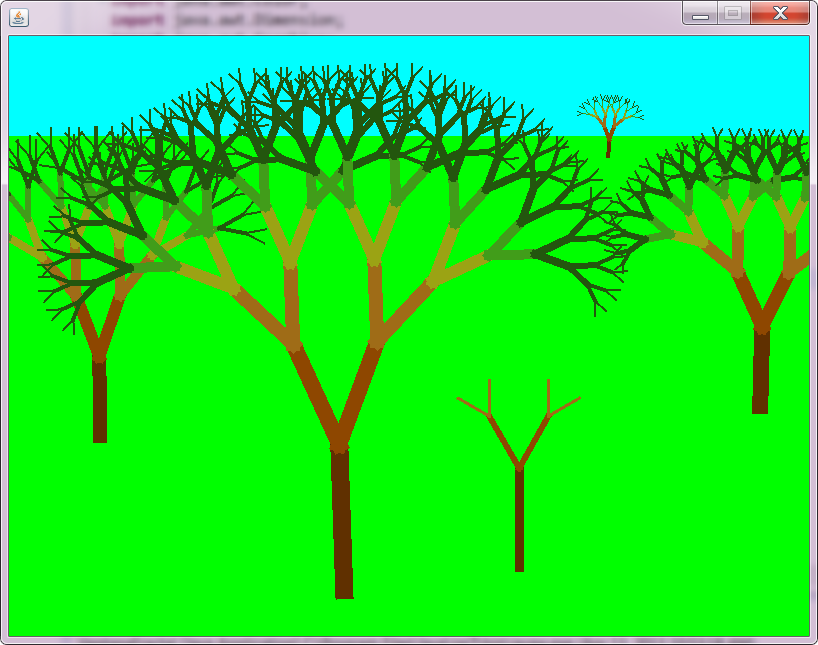

# Arbol Fractal

Dibuja en la pantalla 5 árboles de fractal de diferente tamaño dispuestos en un campo verde.

## Preparación del campo

Es una ventana de 800x600 y coloca la línea de horizonte en X=200. 
Todo lo que está encima de esa línea se pinta azul cielo. 
Todo lo que está por debajo de la línea se pinta verde campo.

## Dibujo de los árboles

Se debe utilizar la base de las fórmulas según lo indicado en la siguiente figura:



Se fabrica una función que haga lo siguiente:

f(x1, y1, x2, y2, n)

"La función f crea la primera rama del árbol del punto x1,y1 a x2,y2 y luego crea n ramas subsecuentes siguiendo el principio del fractal"

Para el caso general queremos obtener el valor de x3,y3. La otra rama se puede obtener de la misma manera.

Se obtiene el ángulo de beta. Este ángulo es el arctan de la pendiente que forman los puntos x1,y1 y x2,y2.

```
beta = arctan( (y2 - y1) / (x2 - x1) )
```

Ese ángulo nos interesa porque solamente al aumentarle el ángulo de alpha tenemos la inclinación que necesitamos para entontrar x3,y3
entonces tenemos el angulo ``final = alpha + beta``
Una vez que tenemos el angulo ``final``, tenemos que calcular ``t``

```
t = raíz cuadrada ( (x2 - x1)2 + (y2 - y1)2 )
```

y el largo de nuestra rama es entonces 0.8 t

Ahora, lo que tenemos que poder calcular es x3, y3 que se nos da gracias a las funciones seno y coseno:

```
x3 = x2 + 0.8 t cos(angulo final)
y3 = y2 + 0.8 t sin(angulo final)
```

## Color en las ramas

Se da un color a cada una de las ramas de los árboles para simular un árbol de verdad. 
Además, también se puede dar un ancho a las líneas. El resultado es el siguiente:



71536527

Encuesta: Bolivia 

++49 176 84 63 1004