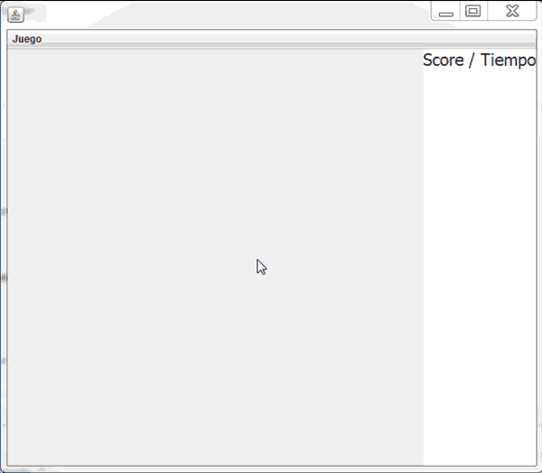
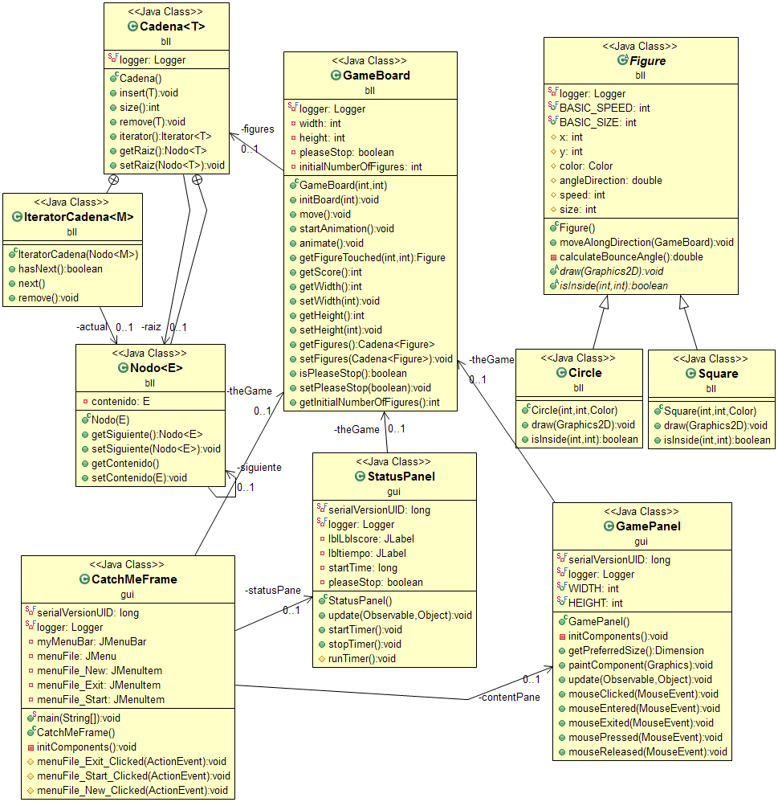

# Catch Me

Este es un programa que es un juego en el que el usuario debe atrapar con el mouse
escurridizas pelotas que están rebotando en la interfase.



Este programa hace uso de las interfases para controlar el clic del mouse. 
Es un buen ejemplo para ver cómo funcionan estas interfases.

Por otro lado, también se hace uso de multiprocesos (threads) para el movimiento
de las figuras en el plano.

Finalmente, el uso del polimorfismo es evidente para poder mostrar diferentes tipos
de figuras en el mismo plano con las mismas operaciones.

## Diagrama de clases



### Polimorfismo

La clase ``Figure`` hace de superclase para las clases ``Circle`` y ``Square``. Eso significa que estas
dos clases heredan todo lo que se define en ``Figure``.

Las cosas en común que tienen son la velocidad, posición y la funcionalidad de moverse. Cómo se muevan dependerá de cada uno pero puede
colocarse aquí una forma de moverse por defecto y así evitar determinarlo en las subclases.

Las funcionalidades que son propias de cada objeto son: ``draw()`` y ``isInside()``. Estos dos métodos son visiblemente muy diferentes
entre las diferentes clases, por ello es que cada uno debe definir estos dos métodos para ver cómo se implementa con esa figura en 
particular.

Un método interesante de ambos es probablemente ``isInside``, aquí se ve el método del ``Square`` (cuadrado):

```

```

### Observer

### Estructura de Datos


