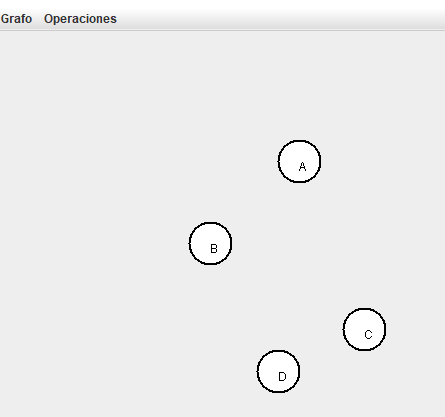
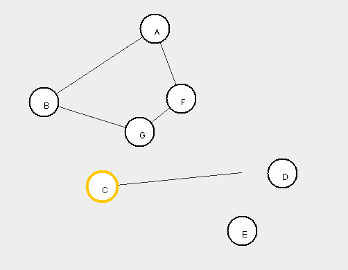

# Dijkstra Gráfico

Este programa permite crear una lista de nodos y arcos de manera dinámica y gráfica.

## Creación de nodos

El programa nos muestra una pantalla en blanco la primera vez y podemos
usar el item Crear Nodo para poder hacer clic en la pantalla e ir
creando nodos.

La creación de los nodos ha sido simplificada ya que el ID del nodo es
tomado automáticamente.

## Creación de arcos

Se puede usar el item del menú Grafo que dice Nuevo Arco para poder elegir
el nodo de inicio con el mouse y luego arrastrar hasta el nodo final.

## Mover nodos

En el menú de Operaciones se puede elegir la opción de Mover Nodo para 
poder hacer clic en cualquier nodo y arrastrar el nodo hasta una nueva
posición. 

El grafo automáticamente actualiza los arcos y dibuja en consecuencia.

## Camino más corto

En el menú de Operaciones se puede elegir la opción de Camino Mas Corto
para elegir dos nodos, el de inicio y el de destino para que el programa
calcule el camino más corto entre ambos.

Se pueden utilizar las demás operaciones al mismo tiempo para poder 
mover los nodos y crear nuevos nodos y arcos y la aplicación actualiza
en tiempo real el camino más corto entre los nodos elegidos.

