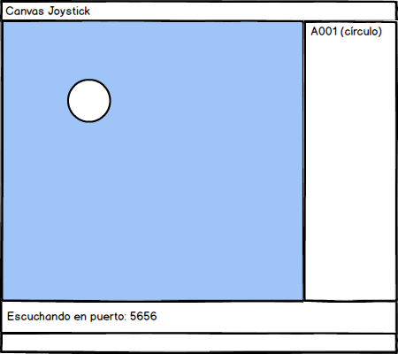
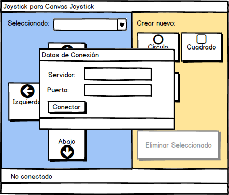

# Joystick

Este programa trata de utilizar las listas creadas en el curso para poder manejar a través de la red una lista de
figuras geométricas que están en un Canvas, potencialmente en otra computadora.

## Enunciado del problema

Este es un programa que tiene 2 componentes: el cliente y el servidor.

### Servidor Canvas Joystick

El servidor es un programa que tiene el modelo (la lista de figuras) y muestra esta lista en su estado actual
en un JPanel de 800x600 pixeles. Cuando una de las figuras cambia su posición, el programa debe poder darse cuenta e 
inmediatamente mostrar el cambio en la interfase. La única forma de lograr mover las figuras es a través del protocolo 
que el servidor entiende. El servidor puede atender varios clientes a la vez, con lo cual al mismo tiempo pueden haber
varias personas moiendo las figuras en el Canvas.

La imagen que se ve del servidor es la imagen luego de ejecutar el programa Servidor y de que ha habido
un cliente que se ha conectado que ha creado un círculo. Este flujo de uso del cliente se puede ver en el
siguiente párrafo.

### Cliente Joystick

El cliente es un programa que se conecta a un servidor Canvas Joystick y comienza a enviarle las instrucciones 
necesarias (definidas en el protocolo) 

Lo primero que debe hacer el cliente es pedir las coordenadas para la conexión. Una vez conectado, el 
cliente indica el estado de la conexión y pide todos los objetos que hay en el servidor y con eso
llena el combo con la lista de objetos; si no hay ninguno no se coloca nada.

Luego el cliente puede comenzar a realizar las operaciones válidas para el servidor. 

* Se puede ver la lista de objetos existentes en el combo
* Se pueden crear hasta 3 tipos de objetos: circulos, cuadrados y triángulos
* Se puede mover ucalquiera de los objetos en cuatro direcciones

Al crear un objeto el cliente debe pedir el nombre del objeto para que sea identificado de manera única por 
el servidor. El servidor responde si pudo o no pudo crearlo. En caso de crearlo automáticamente el
objeto queda almacenado en el combo y también es automáticamente seleccionado.

Con el objeto seleccionado se habilitan los botones para mover en las cuatro direcciones y se puede apretar
en cualquiera de ellos para que muevan en la dirección indicada el objeto seleccionado por 10 pixeles.

## Uso de listas

En el curso heos visto el uso y la creación de Listas dinámicas. Para este práctico se debe utilizar una
y es necesario que tenga implementado el patrón de Iterator.

## Consejos de implementación

Para el servidor es obligatorio el uso de threads para que pueda aceptar varias conexiones al mismo tiempo.

No veo cómo se pueda hacer este programa sin el uso de Observer de manera obsesiva tanto para el servidor
como para el cliente.
