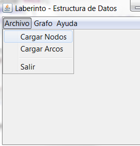
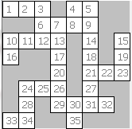
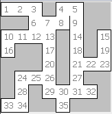
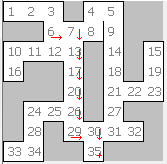
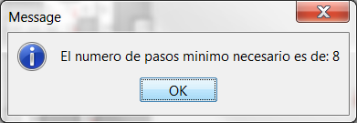

# Laberinto Dijkstra

Este programa crea un laberinto y deja al programa para que encuentre el camino de regreso a casa.
Se utiliza el **algoritmo de Dijkstra** para que el programa encuentre ese camino.

## Ejecución del programa

Aquí cómo se lo debe ejecutar

Ahí se elige primero los nodos que se deben elegir y se ve la configurción de los grafos:

Luego se deben elegir los arcos de los nodos del archivo que se encuentra en la misma carpeta:

Una vez que se cargan los arcos se puede ver que las paredes se abren donde existen arcos para que se pueda ver 
exactamente la configuración del laberinto.

Luego se pueden elegir cualquiera de las dos opciones:

* BFS : Solamente se puede saber la cantidad de pasos mínimo
* Dijkstra : Aquí se puede saber exatamente el recorrido que se debe seguir

### Ejecución Dijkstra

### Ejecución BFS

