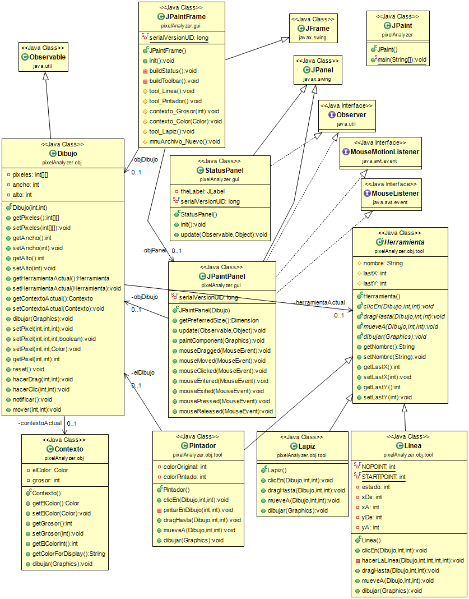
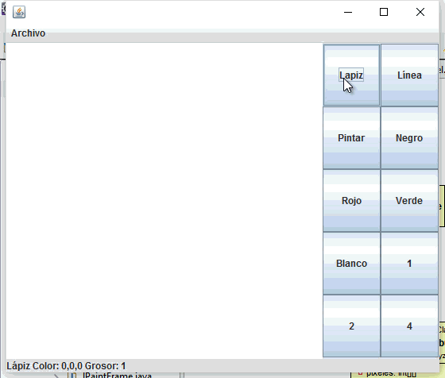

# Pixel Analyzer

El objetivo de este programa es lograr identificar patrones de diseño en un programa real de análisis y edición de imágenes.
Para lograr que de verdad tengamos que lidiar con todos los algoritmos y situaciones necesarias es que el programa
maneja manualmente los pixeles de la figura en un arreglo de enteros.

## Diagrama de clases

Esta figura nos ayudará a entender el diseño que se esconde detrás de nuestro programa:

## Ejecución del programa

Aquí el resultado

