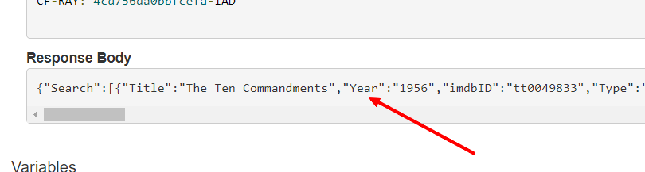
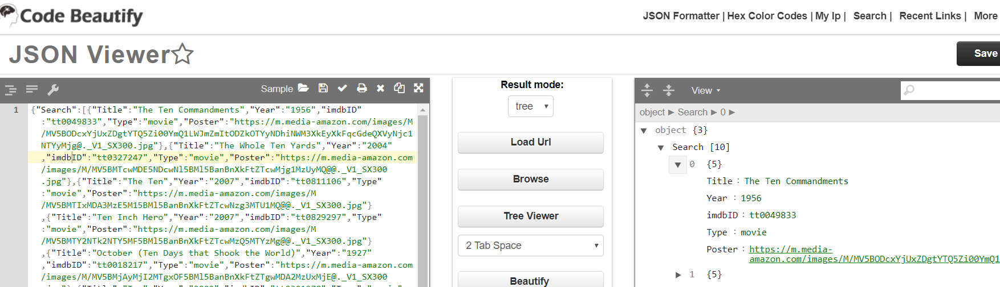

# Practico 4
Se debe desarrollar un solo programa. El programa es un cliente que 
debe conectarse por Internet y obtener listas de información 
**Viernes 3 de Mayo de 2019**.


### Cliente
El cliente es un programa que se conecta a un servicio por internet y obtiene 
la información que se necesita y la presenta en la interfaz gráfica.

## Funcionalidad
El programa cliente debe poder realizar las siguientes operaciones:

1. Buscar una película
2. Listar las películas en la interfaz
3. Cuando se hace clic en cada película la interfaz debe mostrar toda las
información de la película.

### Buscar una película

La interfaz debe permitir una búsqueda de películas por al menos el criterio
de nombre de la película. Adicional y opcionalmente el estudiante puede crear 
la implementación para buscar por otros criterios.

### Listar las películas

Cuando se obtiene el resultado de las búsquedas, estas deben quedar registradas
dentro de una estructura de lista como las que se vio en el curso. Cada uno de los
objetos dentro de esta lista es un objeto de tipo Pelicula que tiene los atributos
que se necesitan para desplegar la película.

### Mostrar la información de la película

Cuando se hace clic en cada uno de los items de la lista entonces el programa
muestra un detalle de la película.

## Protocolo


El protocolo a utilizar es una llamada a un servicio REST que se encuentra en la
siguiente dirección: http://www.omdbapi.com/

Favor utilizar su propia key (llave) para poder hacer los llamados.

Pueden testear el llamado de la siguiente manera:

https://apitester.com/


El resultado se encuentra más abajo en el campo de Response



Y luego se puede ver el resultado así:

https://codebeautify.org/jsonviewer



## Librerías Java

Se puede usar lo siguiente para consultar via REST al servidor:

```
package restclient;
import java.io.BufferedReader;
import java.io.InputStreamReader;
import java.net.HttpURLConnection;
import java.net.URL;

public class NetClientGet {
    public static void main(String[] args) {
        try {

            URL url = new URL("http://localhost:3002/RestWebserviceDemo/rest/json/product/dynamicData?size=5");//your url i.e fetch data from .
            HttpURLConnection conn = (HttpURLConnection) url.openConnection();
            conn.setRequestMethod("GET");
            conn.setRequestProperty("Accept", "application/json");
            if (conn.getResponseCode() != 200) {
                throw new RuntimeException("Failed : HTTP Error code : "
                        + conn.getResponseCode());
            }
            InputStreamReader in = new InputStreamReader(conn.getInputStream());
            BufferedReader br = new BufferedReader(in);
            String output;
            while ((output = br.readLine()) != null) {
                System.out.println(output);
            }
            conn.disconnect();

        } catch (Exception e) {
            System.out.println("Exception in NetClientGet:- " + e);
        }
    }
}
```

## JSON and JAVA

JSON es solamente un formato en el cual se describe una estructura. El problema es
poder leer esta estructura de la manera más sencilla posible. Aquí un ejemplo
con la librería GSON:

```
Gson g = new Gson();

Person person = g.fromJson("{\"name\": \"John\"}", Person.class);
System.out.println(person.name); //John

System.out.println(g.toJson(person)); // {"name":"John"}
```
El estudiante debe crear la clase que tiene los atributos (Pelicula).

Para obtener el JAR de esta librería favor usar el que se encuentra en 
https://search.maven.org/artifact/com.google.code.gson/gson/2.8.5/jar


## Logs obligatorios
Para todas las clases del proyecto es obligatorio el uso de logs con 
la libreria log4j en versión 2. Si el estudiante no tiene los logs 
la nota será de 0. La recomendación para escribir logs es la siguiente:
 - Ponga mensajes claros en cada log
 - Si es un mensaje de debug significa que es más un mensaje para el desarrollador para control interno.
 - Si es un mensaje de info significa que es más un mensaje para el usuario final.
 - Si es un warning significa que ha habido algun problema pero que el programa puede seguir.
 - Si es un error significa que el programa no puede seguir y se muestra el mensaje al usuario.
 - Concatenar el mensaje de log con toda la información de contexto que sea pertinente

